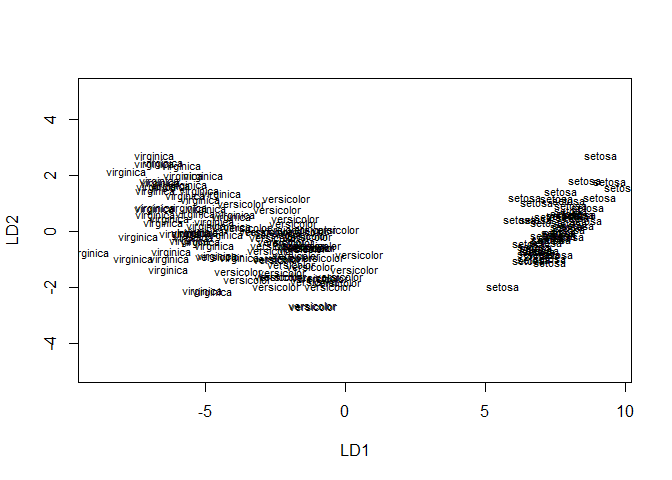
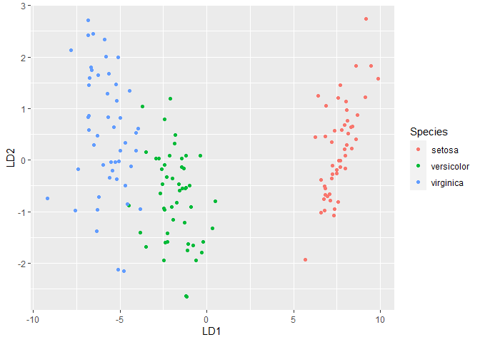

Linear Discriminant Analysis
================

The LDA algorithm starts by finding directions that maximize the
separation between classes, then use these directions to predict the
class of individuals. These directions, called linear discriminants, are
a linear combinations of predictor variables.

LDA assumes that predictors are normally distributed (Gaussian
distribution) and that the different classes have class-specific means
and equal variance/covariance.

The linear discriminant analysis can be easily computed using the
function lda() \[MASS package\].

``` r
library(datasets)
library(MASS)
library(ggplot2)
```

    ## Warning: package 'ggplot2' was built under R version 4.0.5

``` r
library(dplyr)
```

    ## Warning: package 'dplyr' was built under R version 4.0.5

    ## 
    ## Attaching package: 'dplyr'

    ## The following object is masked from 'package:MASS':
    ## 
    ##     select

    ## The following objects are masked from 'package:stats':
    ## 
    ##     filter, lag

    ## The following objects are masked from 'package:base':
    ## 
    ##     intersect, setdiff, setequal, union

## Linear Discriminant Analysis

Linear Discriminant Analysis (LDA) is a dimensionality reduction
technique. As the name implies dimensionality reduction techniques
reduce the number of dimensions (i.e. variables) in a dataset while
retaining as much information as possible. Linear Discriminant Analysis,
or LDA, uses the information from features to create a new axis and
projects the data on to the new axis in such a way as to minimizes the
variance and maximizes the distance between the means of the classes.

``` r
summary(iris)
```

    ##   Sepal.Length    Sepal.Width     Petal.Length    Petal.Width   
    ##  Min.   :4.300   Min.   :2.000   Min.   :1.000   Min.   :0.100  
    ##  1st Qu.:5.100   1st Qu.:2.800   1st Qu.:1.600   1st Qu.:0.300  
    ##  Median :5.800   Median :3.000   Median :4.350   Median :1.300  
    ##  Mean   :5.843   Mean   :3.057   Mean   :3.758   Mean   :1.199  
    ##  3rd Qu.:6.400   3rd Qu.:3.300   3rd Qu.:5.100   3rd Qu.:1.800  
    ##  Max.   :7.900   Max.   :4.400   Max.   :6.900   Max.   :2.500  
    ##        Species  
    ##  setosa    :50  
    ##  versicolor:50  
    ##  virginica :50  
    ##                 
    ##                 
    ## 

``` r
lda.fit<-lda(Species~.,data=iris)
```

Performing Linear Discriminant Analysis on Iris dataset for
classification per Species. LDA determines group means and computes, for
each individual, the probability of belonging to the different groups.
The individual is then affected to the group with the highest
probability score.

The lda() outputs contain the following elements:

Prior probabilities of groups: the proportion of training observations
in each group. For example, there are 31% of the training observations
in the setosa group Group means: group center of gravity. Shows the mean
of each variable in each group. Coefficients of linear discriminants:
Shows the linear combination of predictor variables that are used to
form the LDA decision rule. for example, LD1 = 0.91*Sepal.Length +
0.64*Sepal.Width - 4.08*Petal.Length - 2.3*Petal.Width. Similarly, LD2 =
0.03*Sepal.Length + 0.89*Sepal.Width - 2.2*Petal.Length -
2.6*Petal.Width.

``` r
lda.fit
```

    ## Call:
    ## lda(Species ~ ., data = iris)
    ## 
    ## Prior probabilities of groups:
    ##     setosa versicolor  virginica 
    ##  0.3333333  0.3333333  0.3333333 
    ## 
    ## Group means:
    ##            Sepal.Length Sepal.Width Petal.Length Petal.Width
    ## setosa            5.006       3.428        1.462       0.246
    ## versicolor        5.936       2.770        4.260       1.326
    ## virginica         6.588       2.974        5.552       2.026
    ## 
    ## Coefficients of linear discriminants:
    ##                     LD1         LD2
    ## Sepal.Length  0.8293776  0.02410215
    ## Sepal.Width   1.5344731  2.16452123
    ## Petal.Length -2.2012117 -0.93192121
    ## Petal.Width  -2.8104603  2.83918785
    ## 
    ## Proportion of trace:
    ##    LD1    LD2 
    ## 0.9912 0.0088

``` r
plot(lda.fit)
```

<!-- -->

``` r
predictions <- lda.fit %>% predict(iris)
iris <- cbind(iris, predict(lda.fit)$x)
ggplot(iris, aes(LD1, LD2)) +
  geom_point(aes(color = Species))
```

<!-- -->

References:
<https://towardsdatascience.com/linear-discriminant-analysis-in-python-76b8b17817c2#>:\~:text=Linear%20Discriminant%20Analysis%20(LDA)%20is,as%20much%20information%20as%20possible.

<https://www.displayr.com/linear-discriminant-analysis-in-r-an-introduction/>

<http://www.sthda.com/english/articles/36-classification-methods-essentials/146-discriminant-analysis-essentials-in-r/>

James, Gareth, Daniela Witten, Trevor Hastie, and Robert Tibshirani.
2014. An Introduction to Statistical Learning: With Applications in R.
Springer Publishing Company, Incorporated.
